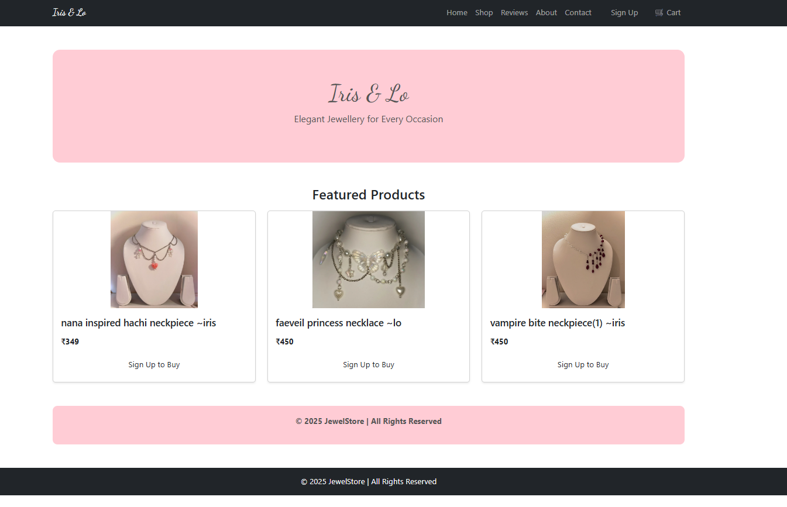

#  Iris&Lo — Online Jewellery & Accessories Store

IrisNlo is a full-stack **MERN** (MongoDB, Express.js, React.js, Node.js) web application designed for a seamless online jewellery and accessories shopping experience.  
The platform provides an elegant interface for users to browse collections, manage their carts, and place orders — while allowing admins to manage inventory efficiently.

---

## 🌟 Features

- 🛍️ **User-Friendly Interface:** Browse jewellery and accessories with ease.  
- 💰 **Secure Purchase Flow:** Add to cart, checkout, and payment integration (upcoming).  
- 👩‍💻 **Admin Dashboard:** Manage products, categories, and stock.  
- ⚡ **Responsive Design:** Works smoothly on desktop and mobile.  
- 🔒 **Authentication:** Secure login and signup with JWT.  

---

## 🧩 Tech Stack

**Frontend:** React.js, HTML, CSS, JavaScript  
**Backend:** Node.js, Express.js  
**Database:** MongoDB  
**Version Control:** Git & GitHub  

---

## 🏗️ Project Structure

irisnlo/
│
├── jewellery-frontend/ # React frontend
│ ├── src/ # Components, pages, and UI logic
│ ├── public/ # Static assets
│ └── package.json # Frontend dependencies
│
└── jewellery-backend/ # Node + Express backend
├── models/ # MongoDB schemas
├── routes/ # API endpoints
├── controllers/ # Business logic
└── package.json # Backend dependencies

---

## 📜 License
This project is licensed under the MIT License

---

## 🚀 Installation

Clone the repository and install dependencies for both frontend and backend.

```bash
git clone https://github.com/shreyat1511/irisnlo.git
cd irisnlo

# For frontend
cd jewellery-frontend
npm install
npm start

# For backend
cd jewellery-backend
npm install
npm run dev
---
---

## Screenshots

### Home Page

